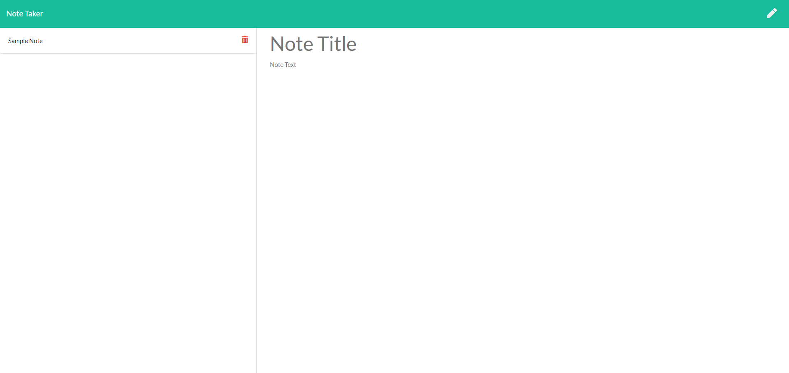

# Note-taker

## Description
Provide a short description explaining the what, why, and how of your project. Use the following questions as a guide:
- This project was made to test my knowledge of backend systems
- This webpage is a tool for keeping notes

## Usage
On load, any saved notes will be displayed on the left, and a blank note template will be on the right. To add a new note, Enter text in both the Note Title and Note Text sections. Then press save in the top right, and it will be added to your saved notes. to view an old note, click on it from the list of notes, and it will appear in the larger left column. The pencil in the top left may be clicked at any time to create a new note. 

```md

```

## License
This project falls under the MIT liscense
---
